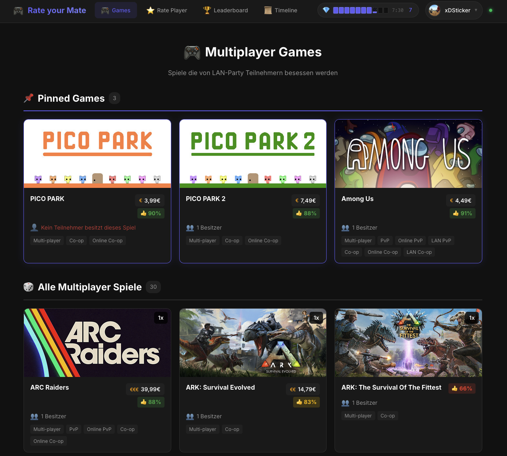
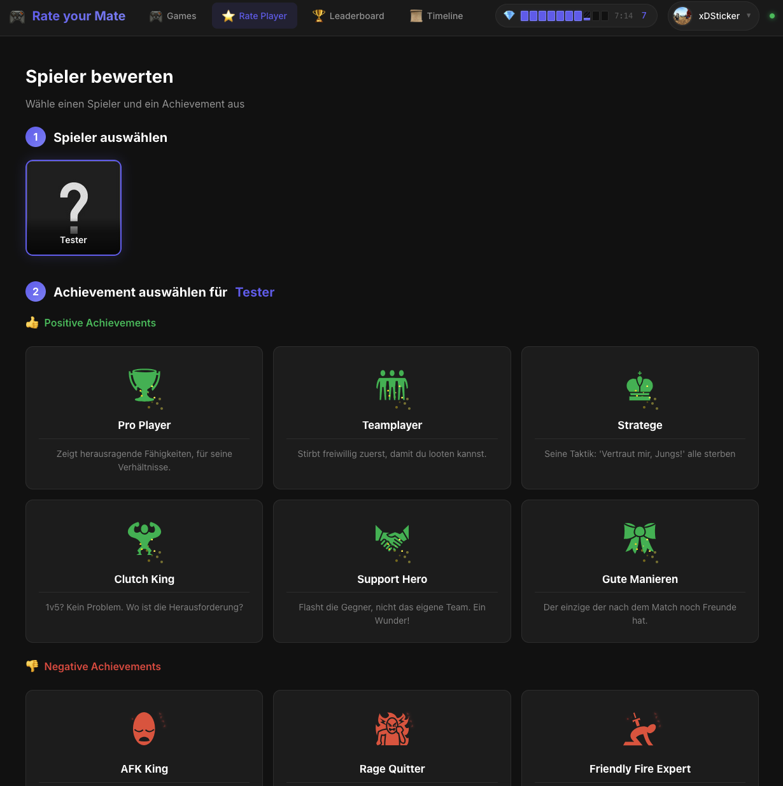
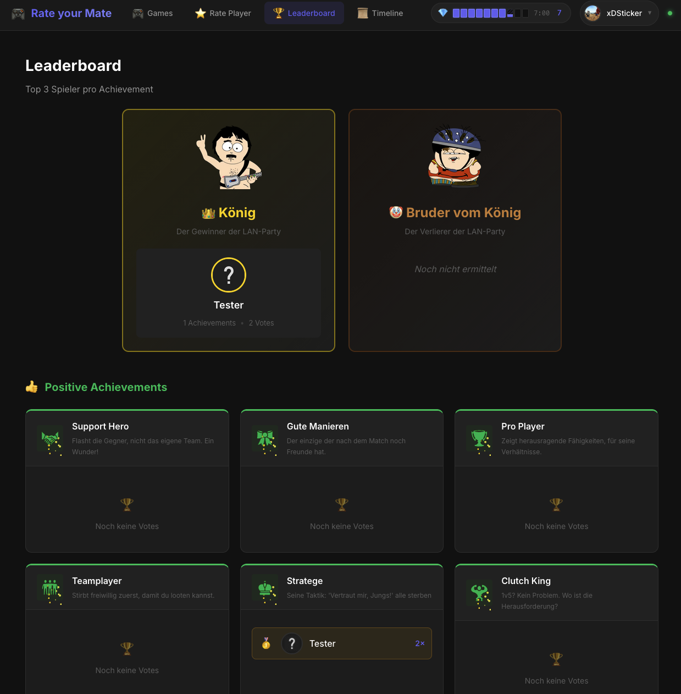
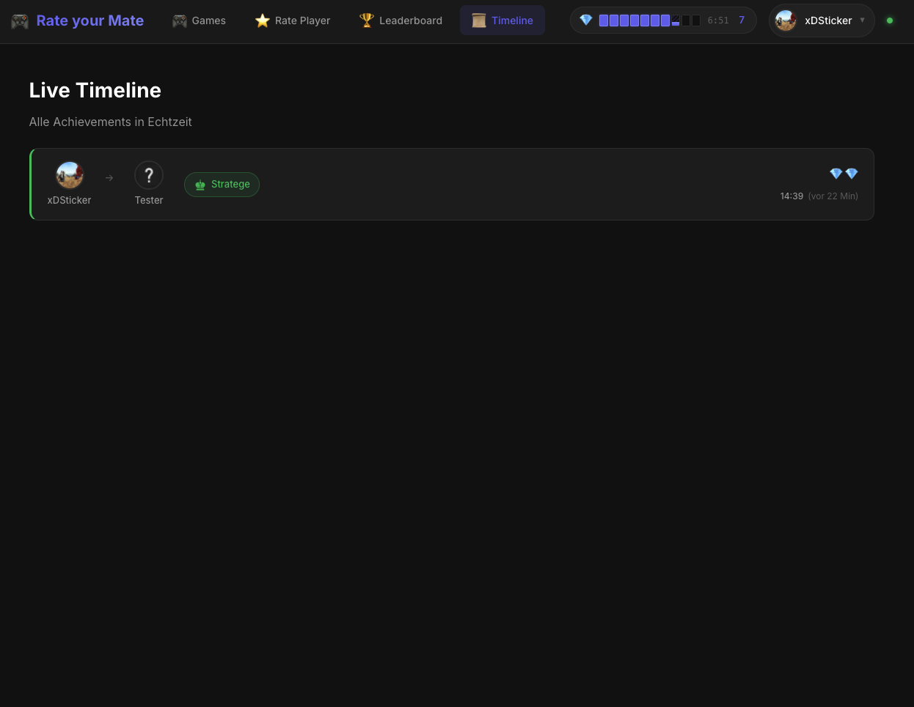
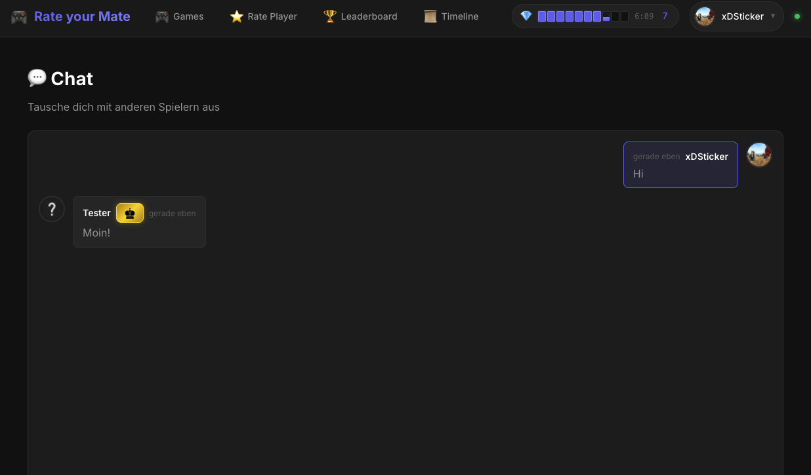

# Rate your Mate

Eine Webanwendung für LAN-Partys, bei der sich Spieler gegenseitig mit Achievements bewerten können.

## ✨ Features

- 🎮 **Steam Login** - Authentifizierung über Steam OpenID
- 💰 **Credit System** - Spieler erhalten automatisch Credits über Zeit
- 🏆 **Achievement Voting** - Spieler bewerten sich gegenseitig mit vordefinierten Achievements
- 📺 **Live Timeline** - Alle Votes in Echtzeit via WebSocket
- 🥇 **Leaderboard** - Top 3 pro Achievement
- 💬 **Chat** - Integrierter Chat für die Community
- 🎲 **Games** - Übersicht der aktuellen Spiele

## 📸 Screenshots

### Games
Übersicht der aktuellen Spiele auf der LAN-Party.



### Rate Player
Bewerte deine Mitspieler mit positiven oder negativen Achievements.



### Leaderboard
Sieh dir die Top 3 Spieler pro Achievement an.



### Timeline
Verfolge alle Votes in Echtzeit – wer hat wen mit welchem Achievement bewertet?



### Chat
Kommuniziere mit anderen Spielern während der LAN-Party.




## 🚀 Installation

### Voraussetzungen

- Kubernetes Cluster
- Helm 3.x
- Steam Web API Key ([hier beantragen](https://steamcommunity.com/dev/apikey))

### Helm Repository hinzufügen

```bash
helm repo add rate-your-mate https://guided-traffic.github.io/rate-your-mate
helm repo update
```

### Installation

```bash
helm install rate-your-mate rate-your-mate/rate-your-mate -f values.yaml
```

## ⚙️ Konfiguration

| Parameter | Beschreibung | Default |
|-----------|--------------|---------|
| `secrets.steamApiKey` | Steam Web API Key (erforderlich) | `""` |
| `secrets.jwtSecret` | JWT Secret für Token-Signierung (erforderlich) | `""` |
| `backend.env.CREDIT_INTERVAL_MINUTES` | Minuten zwischen Credit-Vergabe | `10` |
| `backend.env.CREDIT_MAX` | Maximale Credits pro Spieler | `10` |
| `backend.env.JWT_EXPIRATION_DAYS` | JWT Gültigkeit in Tagen | `7` |
| `ingress.enabled` | Ingress aktivieren | `false` |
| `ingress.hosts` | Ingress Hosts Konfiguration | `[]` |

Alle verfügbaren Optionen findest du in der [values.yaml](helm/rate-your-mate/values.yaml).

## 🗄️ Datenbank-Konfiguration

Rate your Mate unterstützt zwei Datenbank-Backends:

### SQLite (Standard)

SQLite ist der Standard und ideal für kleine Events. Die Daten werden in einer lokalen Datei gespeichert.

```yaml
database:
  type: sqlite
  sqlite:
    path: /app/data/rate-your-mate.db

backend:
  persistence:
    enabled: true
    size: 1Gi
```

### MySQL

Für größere Events oder produktive Umgebungen kann MySQL verwendet werden.

```yaml
database:
  type: mysql
  mysql:
    host: mysql.example.com
    port: 3306
    user: rate_your_mate
    password: secret
    database: rate_your_mate
```

#### MySQL mit externem Secret (empfohlen für Produktion)

```yaml
database:
  type: mysql
  mysql:
    existingSecret:
      name: mysql-credentials
      keys:
        host: mysql-host
        port: mysql-port
        user: mysql-user
        password: mysql-password
        database: mysql-database
```

#### MySQL TLS-Konfiguration

```yaml
database:
  type: mysql
  mysql:
    # ... andere Optionen
    tls:
      enabled: true
      skipVerify: false  # Auf true setzen um Hostname-Verifikation zu überspringen
      caSecret:
        name: mysql-ca-cert
        key: ca.crt
```

#### MySQL Connection Pool

```yaml
database:
  type: mysql
  mysql:
    pool:
      maxOpenConns: 25      # Maximale offene Verbindungen
      maxIdleConns: 5       # Maximale idle Verbindungen
      connMaxLifetime: 5m   # Maximale Lebensdauer einer Verbindung
      connMaxIdleTime: 1m   # Maximale Idle-Zeit einer Verbindung
```

### Umgebungsvariablen (für lokale Entwicklung)

```bash
# Datenbank-Auswahl
DB_TYPE=mysql                    # "sqlite" oder "mysql" (Default: sqlite)
DB_PATH=data/rate-your-mate.db   # SQLite Datenbankpfad

# MySQL-Konfiguration
MYSQL_HOST=localhost
MYSQL_PORT=3306
MYSQL_USER=rate_your_mate
MYSQL_PASSWORD=secret
MYSQL_DATABASE=rate_your_mate

# MySQL TLS
MYSQL_TLS_ENABLED=false
MYSQL_TLS_SKIP_VERIFY=false
MYSQL_TLS_CA_CERT=/path/to/ca.pem

# MySQL Connection Pool
MYSQL_MAX_OPEN_CONNS=25
MYSQL_MAX_IDLE_CONNS=5
MYSQL_CONN_MAX_LIFETIME=5m
MYSQL_CONN_MAX_IDLE_TIME=1m
```

## 🎨 Credits

Achievement-Icons von [Game-icons.net](https://game-icons.net) unter [CC BY 3.0](https://creativecommons.org/licenses/by/3.0/) Lizenz.

## 📄 Lizenz

Apache 2.0
